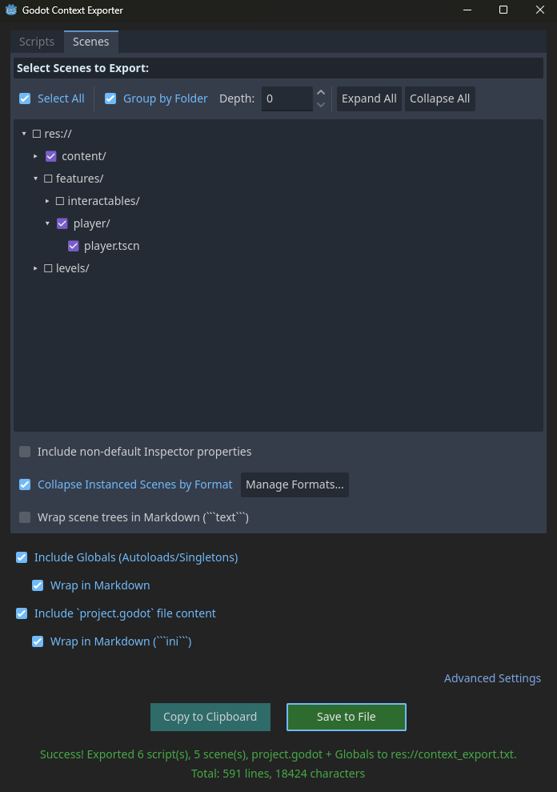
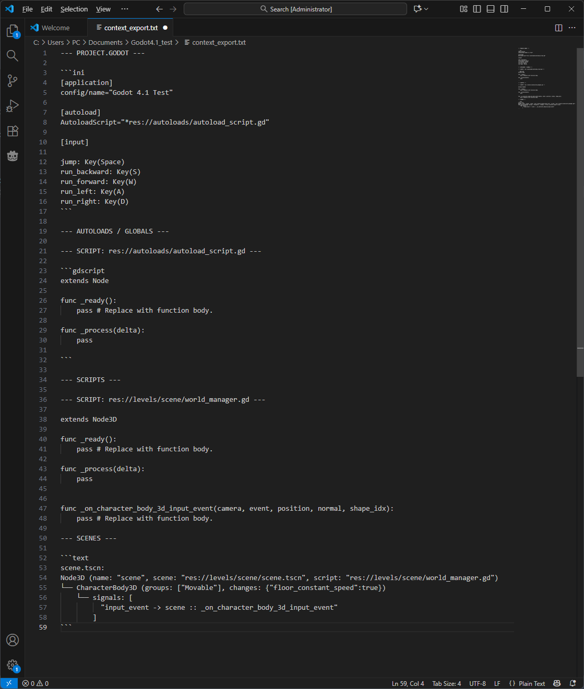
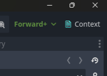

[](https://godotengine.org/asset-library/asset/4500)

Godot 4 plugin that exports selected GDScript files, Scene trees, and Project Settings into a single text file or clipboard.

# Godot Context Exporter


**Primary Use Case:** Quickly gathering project context to share with LLMs or for documentation.

## Key Features  
* **Scene visualization**  Instead of copying a text file, it builds a text tree.  
    ```text
    Player (CharacterBody2D)
    ├── CollisionShape2D
    ├── Sprite2D
    └── Camera2D
        └── signals: [timeout -> _on_timer_timeout]
    ```   

* **Include Signals and Groups** Include Signals and Groups Captures essential logic connections while stripping away noise like internal resource UIDs intended only for engine.
    ```text
    Player (CharacterBody2D)
    ...
    └── Camera2D (groups: ["Movable"])
        └── signals: [timeout -> _on_timer_timeout]
    ```   

* **Inspector's Analysis** Only show properties you've changed in the Inspector. LLM will see: Speed: 500 (modified), but it won't see hundreds of default settings.
    ```text
    └── CharacterBody3D (changes: {"speed":500})
    ```   

* **Merge Similar Nodes** If you have 50 Slimes in a level, it will export (x50) saving 49 lines of context.
    ```text
    Level
    └── CharacterBody2D (x50) (name: "Slime", scene: "res://enemies/Slime.tscn")
        ├── Sprite2D (name: "BodySprite")
        └── CollisionShape2D (name: "HitBox")
    ```

* **Collapse by format** Imported formats like .blend can includes hundreds child nodes, plugin can collapse it in 1 line.  
   * *You can edit desirable formats in Advanced Settings*

* **Autoloads (Globals)** Plugin automatically detects Singletons defined in your Project Settings. Have protection from duplicate if you accidently choose same autoloaded script in Scripts tab.

* **Project Configuration** Exports key settings like Input Map (keys/buttons) and Physics Layers.

* **Markdown** All output is neatly formatted in Markdown blocks.

## Output preview


## Features
*   📂 **Scripts:** Batch export `.gd` or `.cs` files (optionally grouped by folder).
*   🌳 **Scenes:** Text-based visualization of Scene trees (includes Nodes, Signals, Groups, and Inspector changes).
*   ⚙️ **Settings:** Includes `project.godot`, Autoloads (Globals), and cleaned-up Input Map.
*   🤖 **LLM Ready:** Optional Markdown formatting (code blocks) for better parsing by AI.
*   📋 **Output:** Copy directly to Clipboard or save to `res://context_exporter.txt`.

## Installation
1. Copy the folder containing this plugin into your project's `addons/` directory.
2. Go to **Project → Project Settings → Plugins** and enable **Godot Context Exporter**.

## Usage
Click on button in top right corner of editor  
*(you can hide this button in Advanced Settings)*


### Or
Navigate to **Project → Tools → Context Exporter...**

## License
MIT
